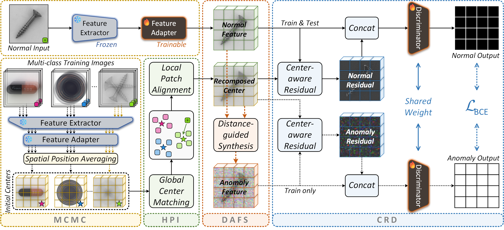
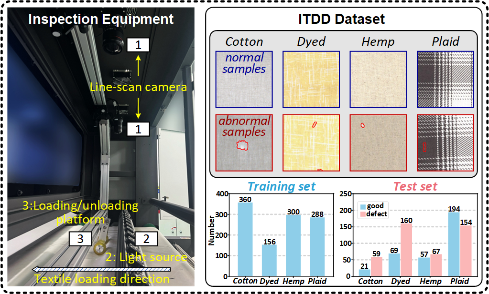

# CRAS



**Center-aware Residual Anomaly Synthesis for Multi-class Industrial Anomaly Detection**

_Qiyu Chen, Huiyuan Luo, Haiming Yao, Wei Luo, Zhen Qu, Chengkan Lv*, Zhengtao Zhang_

IEEE DOI Link & 
[ArXiv Preprint Link](https://arxiv.org/abs/2505.17551)

## Table of Contents
* [📖 Introduction](#introduction)
* [🔧 Environments](#environments)
* [📊 Data Preparation](#data-preparation)
* [🚀 Run Experiments](#run-experiments)
* [📂 Dataset Release](#dataset-release)
* [🔗 Citation](#citation)
* [🙏 Acknowledgements](#acknowledgements)
* [📜 License](#license)

## Introduction
This repository contains source code for CRAS implemented with PyTorch.
CRAS aims to address inter-class interference and intra-class overlap in multi-class anomaly detection
through center-aware residual learning and distance-guided anomaly synthesis.

This repository also contains the self-built dataset ITDD proposed in our paper.

## Environments
Create a new conda environment and install required packages.
```
conda create -n cras_env python=3.9.21
conda activate cras_env
pip install -r requirements.txt
```
Experiments are conducted on NVIDIA GeForce RTX 4090 (24GB).
Same GPU and package version are recommended. 

## Data Preparation
The public datasets employed in the paper are listed below.
The MVTec AD and MPDD datasets retain their original directory structures.
However, you need to run the [provided script](https://github.com/amazon-science/spot-diff/?tab=readme-ov-file#data-preparation)
to convert the VisA dataset to the same layout as MVTec AD.

- MVTec AD ([Download link](https://www.mvtec.com/company/research/datasets/mvtec-ad/))
- VisA ([Download link](https://github.com/amazon-science/spot-diff/))
- MPDD ([Download link](https://github.com/stepanje/MPDD/))

We also release the model weights of CRAS on MVTec AD reported in the paper.
If you want to further explore based on these models,
you need to download the results folder
([Download link](https://drive.google.com/drive/folders/1v6SZD6O3LKVTTliVgp8DeFEqyZ0QCets?usp=sharing))
and move it to the root directory of this repository.
Note that you should clear the existing results folder before moving.

## Run Experiments
Edit `./shell/run-dataset.sh` to configure arguments `--datapath`, `--classes`, and hyperparameter settings.
Please modify argument `--test` to 'ckpt' / 'test' to toggle between training and testing modes.

```
bash run-dataset.sh
```

_"Note that 'dataset' refers to any dataset.
Currently, the `shell` folder contains scripts for four datasets,
such as `run-mvtec.sh` for MVTec AD. If you want to train your own dataset,
please create a new `run-*.sh` file."_

## Dataset Release
### ITDD ([Download link](https://drive.google.com/file/d/1Iy-f_jxJFhSxDc4J0f85wwQKuwj1NzvX/view?usp=sharing/))
The Industrial Textile Defect Detection (ITDD) dataset includes 1885 industrial textile images categorized into 4 categories:
cotton fabric, dyed fabric, hemp fabric, and plaid fabric.
These classes are collected from the industrial production sites of [WEIQIAO Textile](http://www.wqfz.com/en/).
ITDD is an upgraded version of [WFDD](https://github.com/cqylunlun/GLASS?tab=readme-ov-file#1wfdd-download-link)
that reorganizes three original classes and adds one new class.



## Citation
Please cite the following paper if the code and dataset help your project:

```bibtex
@article{chen2025center,
  title={Center-aware Residual Anomaly Synthesis for Multi-class Industrial Anomaly Detection},
  author={Chen, Qiyu and Luo, Huiyuan and Yao, Haiming and Luo, Wei and Qu, Zhen and Lv, Chengkan and Zhang, Zhengtao},
  journal={arXiv preprint arXiv:2505.17551},
  year={2025}
}
```

## Acknowledgements
Thanks for the great inspiration from [SimpleNet](https://github.com/DonaldRR/SimpleNet/), [GLASS](https://github.com/cqylunlun/GLASS/),
and [PBAS](https://github.com/cqylunlun/PBAS/).

## License
The code and dataset in this repository are licensed under the [MIT license](https://github.com/cqylunlun/CRAS?tab=MIT-1-ov-file/).
